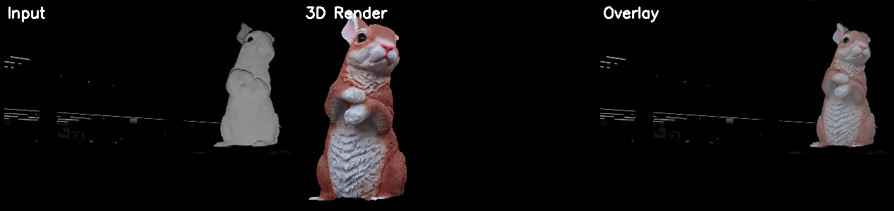
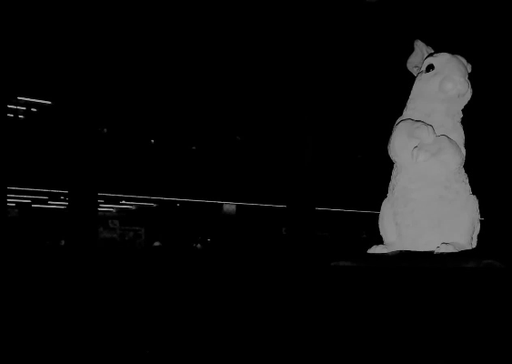
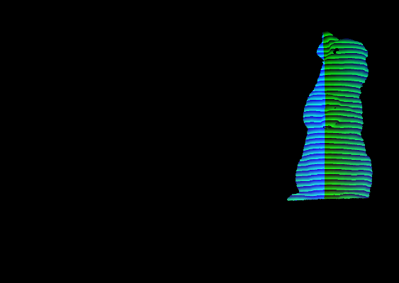
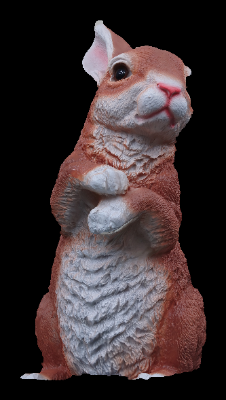
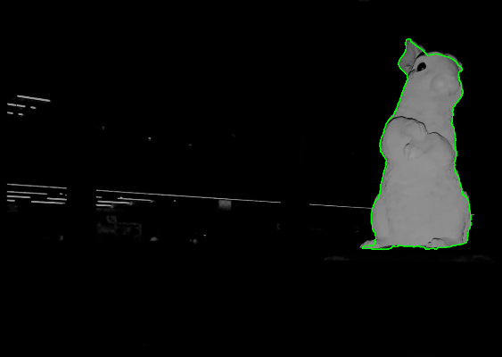
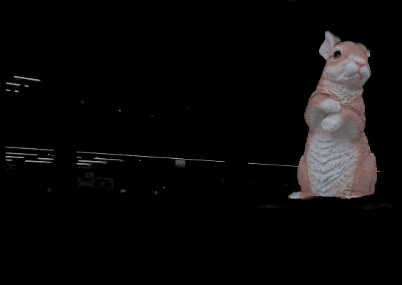
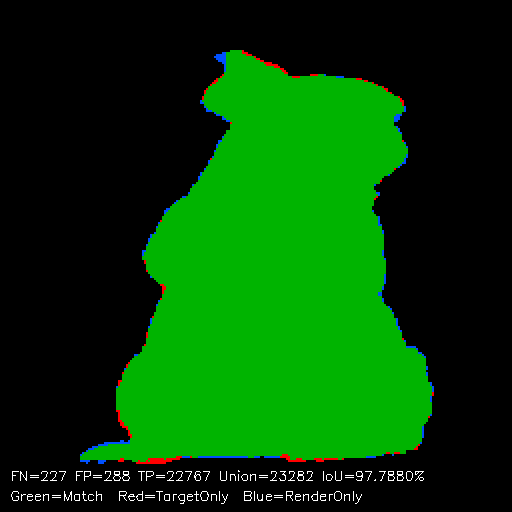
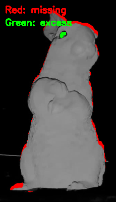

# Silhouette-Based 3D Pose Estimation with Error Concentration Analysis

深度画像から3Dモデルの姿勢（6DoF）を推定するCPU専用パイプライン。GPU・事前学習・学習データセット一切不要で、**IoU 98.03%** を達成。

誤差ピクセルの空間分布を解析する**エラー集中度（Error Concentration Analysis）** により、姿勢推定誤差と物体欠損を自動的に分離する品質指標を提案。



## 特徴

- **GPU不要**: ソフトウェアラスタライザ + OpenMPによるCPU並列処理のみ
- **事前学習不要**: 3Dモデル（OBJ）と深度画像1枚があれば即座に実行可能
- **IoU 98.03%**: 8段階の粗→細グリッドサーチによる高精度姿勢推定
- **エラー集中度**: Gini係数を用いた誤差空間分布解析で、複数のローカルミニマから最適解を自動選択
- **欠損検出**: 姿勢推定と同時に、物体の欠損箇所を特定可能
- **高速**: C++実装で約30秒（ノートPC、512×512レンダリング）

## 手法概要

### 入力

| 撮影画像 | 深度画像 |
|:---:|:---:|
|  |  |

深度画像は構造化光カメラで取得。閾値処理で二値シルエットマスクを抽出し、3Dモデルのレンダリング結果とIoU（Intersection over Union）で比較する。

> **深度画像の利用**: 本手法では深度画像を二値シルエットとして利用する。深度カメラにより前景/背景の分離が閾値処理のみで実現でき、RGB画像で必要なセグメンテーション（GrabCut, U-Net等）が不要となる。深度値自体は姿勢推定には使用しないため、RGB画像からの背景除去でも同様に適用可能。

### 8段階最適化パイプライン

```
Phase 1: 粗い角度探索     ±30° / 5°ステップ（低解像度）
Phase 2: 中間角度探索     ±8° / 1°ステップ
Phase 3: カメラ位置最適化  cam_x, cam_y, cam_z の座標降下法
Phase 4: 精密角度探索     ±1° / 0.2°ステップ
Phase 5: クリッピング最適化 clip_y + clip_slope_x（傾斜クリップ面）
Phase 5b: FOV・距離共同探索 camera_fov と cam_z の2Dスイープ
Phase 6: Edge-guided精密化  cam_z + clip_slope_x + FOV軸の微調整
Phase 7: 特徴マッチング    テクスチャベースの特徴点対応で最終補正
```

各フェーズで最良IoUの候補を次フェーズの初期値とし、探索範囲を段階的に狭める。全探索はOpenMPで並列化。

### 出力

| テクスチャ付きレンダリング | 輪郭オーバーレイ | 50%ブレンド |
|:---:|:---:|:---:|
|  |  |  |

## エラー集中度（Error Concentration Analysis）

シルエットIoUだけでは「姿勢が間違っている」のか「物体に欠損がある」のか区別できない。本手法では、誤差ピクセルの空間的偏りを定量化することで両者を分離する。

### 着想

- **正しい姿勢** → 誤差は欠損箇所に局所的に集中
- **間違った姿勢** → 誤差がシルエット全体に分散

### 指標

| 指標 | 定義 | 意味 |
|------|------|------|
| **Gini係数** | シルエット重心から12方向セクターの誤差ピクセル数の偏り | 高い = 特定方向に集中 = 欠損由来 |
| **平均境界距離** | ターゲットとレンダーの輪郭間の最近傍点距離の平均 | 低い = 輪郭の整合性が高い = 姿勢が正確 |
| **Combined Score** | `IoU × (1 + α・Gini − β・MeanBoundaryDist)` | IoU・集中度・境界精度の統合評価 |

### 差分マスク（Diff Mask）



**赤**: モデルにない領域（FN=176px） / **緑**: モデルが余分にはみ出た領域（FP=285px）

誤差が耳先端と足元に集中しており、ポーズ自体は正確であることを示している。

### 最終結果

```
IoU:              98.03%
Gini係数:         0.326（誤差が特定方向に集中）
平均境界距離:      0.610px（サブピクセル精度）
P90境界距離:      1.414px
FN / FP:         176 / 285 px
Combined Score:   0.9805
```

## 既存手法との比較

| | 本手法 | ICP | DenseFusion | FoundationPose |
|---|---|---|---|---|
| 入力 | 深度→シルエット | 点群 | RGB-D | RGB(-D) |
| GPU | **不要** | 不要 | 必要 | 必要 |
| 事前学習 | **不要** | 不要 | 必要 | 必要 |
| 学習データ | **不要** | 不要 | 数千枚〜 | 数千枚〜 |
| 欠損対応 | **品質スコアで自動判定** | なし | なし | 部分的 |
| 処理時間 | ~30秒 (CPU) | ~1秒 | ~0.1秒 (GPU) | ~0.5秒 (GPU) |

## 残り約2%のミスマッチの原因



| 箇所 | 原因 | 改善の難しさ |
|------|------|------------|
| 耳先端 | 実物の耳が薄く柔軟で撮影時にわずかに変形。剛体モデルでは再現不可 | 3Dモデル形状の限界 |
| 足元 | テーブルとの接地面。クリッピング面で近似するが完全一致は不可能 | 接地形状の差 |
| 右側輪郭 | 3Dモデルの体表面と実物の微細な凹凸差（数ピクセル） | スキャン精度の限界 |

## 苦労した点

### 1. 回転順序の不一致
Three.js（ビューアー）で調整した角度をC++に持ち込んだところ、全く異なる姿勢になった。原因は**回転順序（XYZ vs ZYX）の不一致**。3D回転は非可換なので、順序が変わると結果が全く変わる。全コードをZYX順序に統一して解決。

### 2. 正規化によるカメラ位置の無効化
シルエットをバウンディングボックスで切り出してリサイズ（正規化）する設計のため、カメラの平行移動（cam_x, cam_y）を変えても正規化後のIoUがほぼ変わらない。座標降下法で軸ごとに探索し、clip_y との組み合わせ最適化でようやく改善できた。

### 3. 探索空間の爆発
3軸回転（theta, phi, roll）× カメラ3軸 × clip_y × clip_slope_x × FOV = **9次元の最適化問題**。全探索は不可能なので、深度推定で初期値を絞り込み（±30°以内）、多段階で解像度を上げる戦略を取った。

### 4. 無限ループバグ
`g_tune.*` をforループ条件で使いながらループ内で値を変更し、ループが終了しなくなるバグが発生。ループ前にcenter値を保存して修正。

## 今後の課題

- **深度値の活用**: 現在はシルエットのみ使用。対称物体では前後の曖昧性が生じるため、深度マップ比較で前後判定を行う拡張が有効
- **複数物体への対応**: 現在は1物体のみ。異なる形状（対称/非対称）での汎用性検証(最優先)
- **レンズ歪み補正**: カメラキャリブレーションデータを用いた歪み適用

## 実行方法

### 必要環境
- Visual Studio 2022
- OpenCV 4.x
- CMake

### ビルドと実行

```bash
cd cpp_pipeline
cmake -B build -G "Visual Studio 17 2022" -A x64
cmake --build build --config Release
./build/Release/pose_match.exe
```

入力画像を変更する場合:
```bash
./build/Release/pose_match.exe --input-image path/to/image.png
```

## プロジェクト構成

```
├── cpp_pipeline/
│   ├── CMakeLists.txt            # ビルド設定
│   └── main.cpp                  # C++ パイプライン (~2250行)
├── models_rabit_obj/
│   ├── rabit.obj                 # 高ポリモデル (427K faces)
│   ├── rabit_low.obj             # 低ポリモデル (60K faces)
│   ├── rabit_low.stl             # STL版 (GitHub 3D表示用)
│   └── rabit01.jpg               # テクスチャ
├── docs/                         # README用画像
├── Image0.png                    # 入力画像
├── Image0_depth.png              # 深度画像
└── rotation_results_cpp/         # 出力結果
```

## ライセンス

MIT License
