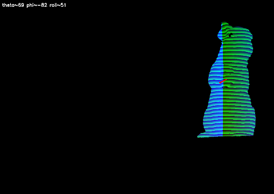

# Silhouette-Based 3D Pose Matching

写真に写ったオブジェクトの3D姿勢（回転角度・カメラ位置）を、シルエットのIoU（Intersection over Union）最大化により推定するシステムです。

**深度画像から初期角度を推定し、多段階グリッドサーチで最適解を探索します。** SQLiteによる40万パターン事前検索は不要で、深度画像1枚から直接推定できます。

## 結果

入力画像から3Dモデルの姿勢を推定し、テクスチャ付きで重ね合わせた結果です。


**最終IoU: 97.0%** | 実行時間: 35秒（C++版）

## 処理の流れ

### 1. 入力

撮影画像と構造化光による深度画像を入力として使用します。

| 撮影画像 | 深度画像 |
|:---:|:---:|
|  |  |

### 2. 深度画像から角度推定

深度画像のB-G値を深度として解析し、勾配相関と等高線から3軸の回転角度を推定します。



| パラメータ | 推定手法 | 推定誤差 |
|-----------|---------|---------|
| theta（水平回転） | `asin(-grad_x / 0.35)` + 左右面積比補正 | 25.5° |
| phi（垂直傾き） | `-90 + grad_y * 50` | 1.3° |
| roll（回転） | 深度等高線の角度変化トレンド × 6 | 4.5° |

### 3. 多段階最適化

推定角度を初期値として、粗い探索→細かい探索→カメラ位置調整を段階的に実行します。

```
Phase 1: ±30° / 5°ステップ (低解像度) ───→ 3.3秒
Phase 2: ±8°  / 1°ステップ            ───→ 8.3秒
Phase 3: カメラ位置の座標降下法        ───→ 6.5秒
Phase 4: ±1°  / 0.2°ステップ (精密)   ───→ 14秒
Phase 5: clip_y (足元クリッピング)     ───→ 0.2秒
```

### 4. テクスチャ付きオーバーレイ

最適パラメータで高ポリモデル（427K面）をテクスチャ付きでレンダリングし、元画像に重ね合わせます。

| テクスチャ付きレンダリング | 輪郭オーバーレイ | 50%ブレンド |
|:---:|:---:|:---:|
|  |  |  |

## 欠損箇所とミスマッチ分析

IoU 97% は高い値ですが、残り3%のミスマッチは以下の箇所に集中しています。


**赤: モデルが欠損している領域 / 緑: モデルが余分にはみ出た領域**

| 箇所 | 原因 | 改善の難しさ |
|------|------|------------|
| 足元 | `clip_y` パラメータで足元をワールド座標でクリッピングしている。3Dモデルの足と実物の足で接地形状が異なるため、閾値を調整しても完全一致できない | 3Dモデルの形状自体の限界 |
| 右側輪郭 | 3Dモデルの体表面の凹凸が実物と微妙に異なる。特に腹部〜背中のラインが数ピクセルずれる | スキャン精度の限界 |
| 耳先端 | 実物の耳は薄く柔らかいため撮影時にわずかに曲がるが、3Dモデルの耳は固定形状 | 剛体モデルでは変形を表現できない |
| 目の周囲（緑） | 3Dモデルの目はテクスチャで黒く塗られており、シルエット上は存在する。実物の目も黒いが照明条件で暗く写りマスクから欠落することがある | マスク生成の閾値の問題 |

## 苦労した点

### 1. 回転順序の不一致

Three.js（ビューアー）で調整した角度をPythonに持ち込んだところ、全く異なる姿勢になった。原因は **回転順序（XYZ vs ZYX）の不一致**。3D回転は非可換なので、順序が変わると結果が全く変わる。全コードをZYX順序に統一して解決した。

### 2. 足元の白テクスチャ問題

`clip_y` で足元をクリッピングすると、切断面の三角形に白いテクスチャが描画されるバグが発生。原因は境界面のUV座標がテクスチャの白い領域を参照していたこと。クリッピング後に元画像のマスクで `bitwise_and` することで解決した。

### 3. 正規化によるカメラ位置の無効化

シルエットをバウンディングボックスで切り出してリサイズ（正規化）する設計のため、カメラの平行移動（cam_x, cam_y）を変えても正規化後のIoUがほぼ変わらない。座標降下法で軸ごとに探索し、clip_y との組み合わせ最適化でようやく改善できた。

### 4. 深度画像のマスク誤り

深度画像の解析で、元画像のマスクを使ってしまい左側の深度値が全てゼロになるバグが発生。深度画像にはカメラの視野が異なるため **深度画像自体のマスク** を使う必要があった。

### 5. 探索空間の爆発

3軸回転（theta, phi, roll）× カメラ3軸 × clip_y = **7次元の最適化問題**。全探索は不可能なので、深度推定で初期値を絞り込み（±30°以内）、多段階で解像度を上げる戦略を取った。

## これ以上の精度向上が難しい理由

**IoU 97% が事実上の上限に近い理由:**

1. **3Dモデルと実物の形状差**
   - 3Dモデルはスキャンデータから生成されたものだが、スキャン時と撮影時でオブジェクトの状態が完全に同一ではない
   - 耳や毛並みなどの微細な形状は剛体モデルでは再現できない

2. **シルエットベース手法の本質的限界**
   - シルエット（2D輪郭）だけでは、奥行き方向の形状差が見えない
   - 異なる姿勢でも似たシルエットになる場合がある（曖昧性）
   - 1ピクセルのずれが IoU を 0.1% 程度下げる

3. **カメラモデルの簡略化**
   - レンズ歪み（ディストーション）を考慮していない
   - 実際のカメラは透視投影＋放射歪みだが、現在は理想的な透視投影のみ

4. **マスク生成の不完全さ**
   - 入力画像から単純な輝度閾値でマスクを生成しているため、暗い部分（目、影）が欠落する可能性
   - 背景光（構造化光の反射縞）がマスクに混入する場合がある

## 今後の課題

- [ ] **GPU レンダリング（OpenGL）** : ソフトウェアラスタライザをGPU化すれば探索速度が100倍向上する可能性
- [ ] **微分可能レンダリング** : PyTorch3D等を用いた勾配ベースの最適化で、グリッドサーチを置き換える
- [ ] **レンズ歪み補正** : カメラキャリブレーションデータを用いて、レンダリング時に歪みを適用
- [ ] **深度画像の直接利用** : シルエットIoUだけでなく、深度マップ同士のL2距離も目的関数に加える
- [ ] **複数視点対応** : 複数角度から撮影した画像を同時に使い、曖昧性を解消
- [ ] **セグメンテーション** : 単純な輝度閾値でなく、学習ベースのセグメンテーションでマスク精度を向上

## 3Dモデル

使用している3Dモデル（低ポリ版）を直接確認できます。

[rabit_low.stl をブラウザで3D表示](models_rabit_obj/rabit_low.stl)

## 実装

### C++ 版（推奨）

C++ + OpenCV + OpenMP による高速実装です。

**必要環境:**
- Visual Studio 2022
- OpenCV 4.x
- CMake

**ビルドと実行:**

```bash
cd cpp_pipeline
cmake -B build -G "Visual Studio 17 2022" -A x64
cmake --build build --config Release
build\Release\pose_match.exe
```

### Python 版

```bash
pip install -r requirements.txt
```

| スクリプト | 説明 |
|-----------|------|
| `estimate_angle_from_depth.py` | 深度画像から初期角度を推定 |
| `pose_match_unified.py` | SQLiteベースの統合マッチング |
| `generate_features_sqlite.py` | 特徴量データベース生成（40万パターン） |

## 性能比較

| | Python版 | C++版 |
|---|---------|-------|
| IoU | 97.05% | 97.03% |
| 実行時間 | 数分〜十数分 | **35秒** |
| 事前DB | 113MB 必要 | **不要** |
| 前処理 | DB生成に数時間 | **不要** |
| テクスチャ描画 | 数秒 | **0.15秒** |

## 座標系

- 回転順序: **ZYX**（Z→Y→X の順に適用）
- 初期回転: X軸に -90°（OBJモデルの座標系変換）
- カメラ: 透視投影（FOV 45°）

## プロジェクト構成

```
├── cpp_pipeline/
│   ├── CMakeLists.txt            # ビルド設定
│   └── main.cpp                  # C++ 全パイプライン
├── estimate_angle_from_depth.py  # 深度→角度推定 (Python)
├── pose_match_unified.py         # 統合マッチング (Python)
├── generate_features_sqlite.py   # 特徴量DB生成 (Python)
├── models_rabit_obj/
│   ├── rabit.obj                 # 高ポリモデル (427K faces)
│   ├── rabit_low.obj             # 低ポリモデル (60K faces)
│   ├── rabit_low.stl             # STL版 (GitHub 3D表示用)
│   └── rabit01.jpg               # テクスチャ
├── docs/                         # README用画像
├── Image0.png                    # 入力画像
├── Image0_depth.png              # 深度画像
└── requirements.txt
```

## ライセンス

MIT License
